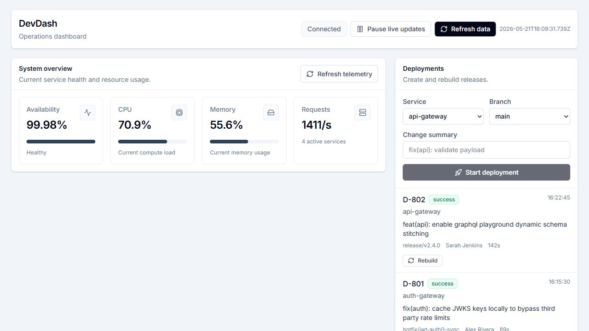
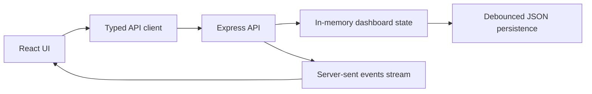
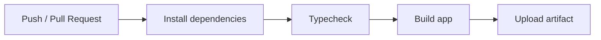

# DevDash

DevDash is a minimal operations dashboard for monitoring service health, latency, deployments, incidents, security events, logs, and command actions from one place.

The project started as a visual dashboard prototype and has been converted into a usable full-stack application with a same-origin Express backend, live server-sent updates, typed React state, and explicit operator controls.



## Table Of Contents

- [Purpose](#purpose)
- [What DevDash Does](#what-devdash-does)
- [UX Direction](#ux-direction)
- [Architecture](#architecture)
- [Backend API](#backend-api)
- [Run Locally](#run-locally)
- [Production Build](#production-build)
- [Project Structure](#project-structure)
- [CI/CD](#cicd)
- [Contributor Scope](#contributor-scope)
- [Future Scope](#future-scope)

## Purpose

DevDash is designed for developers and small operations teams who need a clear view of what is happening across an application stack without opening several tools.

The goal is not to look futuristic or decorative. The goal is to make operational state easy to understand and easy to act on:

- Is the system healthy?
- Which services are slow or unstable?
- Are deployments running, failed, or complete?
- Which incidents need attention?
- What security events are being blocked or investigated?
- What recent logs explain the current state?
- What commands can the operator run safely?

## What DevDash Does

DevDash currently provides:

- **System overview**: availability, CPU, memory, request rate, and active services.
- **Service and latency view**: 24-hour latency chart plus node-level CPU, RAM, ping, and status.
- **Full node control**: set a node directly to `Healthy`, `Unstable`, or `Offline`.
- **Deployments**: start a deployment, see recent deployment history, and rebuild completed or failed deployments.
- **Web vitals**: inspect user-facing page performance metrics such as LCP, FID, CLS, FCP, and TTFB.
- **Incidents**: search, filter, acknowledge, resolve, expand, and copy stack traces.
- **Security events**: review blocked, mitigated, and investigated requests.
- **Logs**: read recent service logs in a compact stream.
- **Command log**: run useful preset commands or enter supported commands manually.
- **Live updates**: stream backend changes to the UI with pause/resume control.
- **Manual refresh**: fetch the latest dashboard state on demand.

## UX Direction

The UI intentionally uses a minimal operations style:

- Neutral colors and clear spacing.
- Plain section names instead of buzzwords.
- Static status badges instead of blinking indicators.
- Tables and forms where users need control.
- Explicit controls for risky or meaningful actions.
- Manual refresh and pause/resume live updates so the user remains in control.

The interface should answer "what is this?" without requiring the user to decode labels or animation.

## Architecture

DevDash is a single Node application that serves both the API and the React UI.



### Frontend

- React 19
- TypeScript
- Vite
- Tailwind CSS
- Lucide icons
- Same-origin API requests through `src/apiClient.ts`

### Backend

- Express 4
- TypeScript executed with `tsx` in development
- Bundled with `esbuild` for production
- In-memory state for fast reads
- Debounced JSON persistence at `server/data/devdash-state.json`
- Server-sent events at `/api/stream`
- ETag support for optimized dashboard snapshot responses

For a deeper architecture breakdown, data flow diagrams, state diagrams, CI/CD diagrams, and deployment notes, see [docs/architecture.md](docs/architecture.md).

## Backend API

All API routes are same-origin under `/api`.

### Health And State

| Method | Endpoint | Purpose |
| --- | --- | --- |
| `GET` | `/api/health` | Returns server health, uptime, state version, and server time. |
| `GET` | `/api/dashboard` | Returns the complete dashboard snapshot. |
| `GET` | `/api/dashboard/state` | Alias for the complete dashboard snapshot. |
| `GET` | `/api/stream` | Opens a server-sent events stream of dashboard updates. |

### Metrics

| Method | Endpoint | Purpose |
| --- | --- | --- |
| `GET` | `/api/system/status` | Returns only system status metrics. |
| `GET` | `/api/latency` | Returns latency history. |
| `POST` | `/api/system/refresh` | Refreshes system telemetry. |
| `POST` | `/api/vitals/refresh` | Refreshes web vitals. |

### Nodes

| Method | Endpoint | Purpose |
| --- | --- | --- |
| `POST` | `/api/nodes/:id/toggle` | Cycles a node through statuses. Kept for compatibility. |
| `POST` | `/api/nodes/:id/status` | Sets a node status directly. Body: `{ "status": "healthy" \| "unstable" \| "offline" }`. |

### Incidents

| Method | Endpoint | Purpose |
| --- | --- | --- |
| `GET` | `/api/errors` | Returns active incidents. |
| `POST` | `/api/errors/:id/acknowledge` | Acknowledges an incident. |
| `DELETE` | `/api/errors/:id` | Resolves an incident. |

### Deployments

| Method | Endpoint | Purpose |
| --- | --- | --- |
| `GET` | `/api/deployments` | Returns deployment history. |
| `POST` | `/api/deployments` | Starts a deployment. |
| `POST` | `/api/deployments/:id/rebuild` | Rebuilds an existing deployment. |

### Security, Logs, And Commands

| Method | Endpoint | Purpose |
| --- | --- | --- |
| `GET` | `/api/threats` | Returns security events. |
| `GET` | `/api/logs?limit=100` | Returns recent logs. |
| `POST` | `/api/cli/execute` | Runs a supported command. Body: `{ "command": "Diagnostics" }`. |

## Run Locally

### Prerequisites

- Node.js 20 or newer recommended
- npm

### Install

```bash
npm install
```

### Start Development Server

```bash
npm run dev
```

Open:

```text
http://localhost:3000
```

The development server runs the Express API and Vite UI together on one port.

## Production Build

Build the frontend and server bundle:

```bash
npm run build
```

Start the production server:

```bash
npm run start
```

## Scripts

| Command | Purpose |
| --- | --- |
| `npm run dev` | Starts Express with Vite middleware. |
| `npm run build` | Builds the Vite UI and bundles the server. |
| `npm run start` | Runs the production `server.js`. |
| `npm run lint` | Runs TypeScript checks with `tsc --noEmit`. |
| `npm run preview` | Builds and starts the production app. |

## Project Structure

```text
.
├── .github/
│   └── workflows/
│       └── ci.yml
├── docs/
│   ├── architecture.md
│   └── screenshots/
│       └── dashboard-overview.png
├── server/
│   ├── index.ts
│   └── state.ts
├── src/
│   ├── components/
│   ├── apiClient.ts
│   ├── App.tsx
│   ├── index.css
│   ├── main.tsx
│   ├── mockData.ts
│   └── types.ts
├── package.json
├── tsconfig.json
└── vite.config.ts
```

## CI/CD

DevDash includes a GitHub Actions workflow at `.github/workflows/ci.yml`.

The workflow runs on pushes, pull requests, and manual dispatch:

1. Check out the repository.
2. Set up Node.js 22.
3. Install dependencies with `npm ci`.
4. Run TypeScript checks with `npm run lint`.
5. Build the production app with `npm run build`.
6. Upload the production build as a workflow artifact.



Actual deployment is intentionally left host-specific because Render, Railway, Fly.io, VPS, and Docker-based hosts all require different secrets and deployment commands. See [docs/architecture.md](docs/architecture.md) for the recommended deployment model.

## Data Model

The core dashboard snapshot contains:

- `systemStatus`
- `latencyHistory`
- `errorTraces`
- `webVitals`
- `deployments`
- `serverNodes`
- `securityThreats`
- `liveLogs`
- `cliLogs`
- `serverTime`
- `version`

Shared frontend/backend types live in `src/types.ts`.

## Contributor Scope

Contributors can help in several areas:

### Frontend Contributors

- Improve responsive layouts.
- Add accessible keyboard interactions.
- Refine forms, filters, and table ergonomics.
- Add empty, loading, and error states.
- Keep the UI simple and task-focused.

### Backend Contributors

- Replace mock state with real integrations.
- Add authentication and role-based controls.
- Add request validation and stronger error responses.
- Add database persistence.
- Add audit logging for operational actions.

### DevOps Contributors

- Add Docker support.
- Add CI checks for lint/build.
- Add deployment examples for Render, Railway, Fly.io, or VPS hosting.
- Add environment-specific configuration.

### Documentation Contributors

- Add more screenshots.
- Add API examples.
- Add architecture diagrams.
- Add troubleshooting notes.
- Keep setup instructions current.

## Development Guidelines

- Prefer explicit controls over hidden gestures.
- Prefer plain wording over branding or hype.
- Avoid blinking indicators and decorative animation.
- Keep destructive or risky actions obvious.
- Run `npm run lint` before opening a pull request.
- Run `npm run build` when changing server or Vite config.
- Do not commit `node_modules`, `dist`, `server.js`, `.env`, or runtime state files.

## Future Scope

Planned improvements:

- Real service integrations for metrics, logs, deployments, and incidents.
- User accounts and role-based access control.
- Audit history for every command and operational action.
- Persistent database storage with migrations.
- Configurable service inventory instead of hard-coded mock services.
- Alert routing for unresolved incidents.
- Better deployment lifecycle states such as queued, building, testing, deploying, completed, and rolled back.
- More node controls such as drain, restart, disable traffic, and restore traffic.
- Exportable incident reports.
- Dark mode as an optional preference, not the default.
- Automated test coverage for API routes and React interactions.

## Current Limitations

- The data is simulated.
- The backend is single-node and stores runtime state in memory with JSON persistence.
- Authentication is not implemented.
- Commands are simulated and do not run real infrastructure operations.

## License

DevDash is licensed under the [Apache License 2.0](LICENSE).

Apache-2.0 was chosen because it is a mature open-source license with an explicit patent grant, clear redistribution terms, and broad compatibility for personal, commercial, and contributor-driven use.
