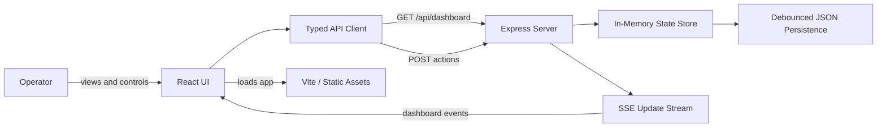
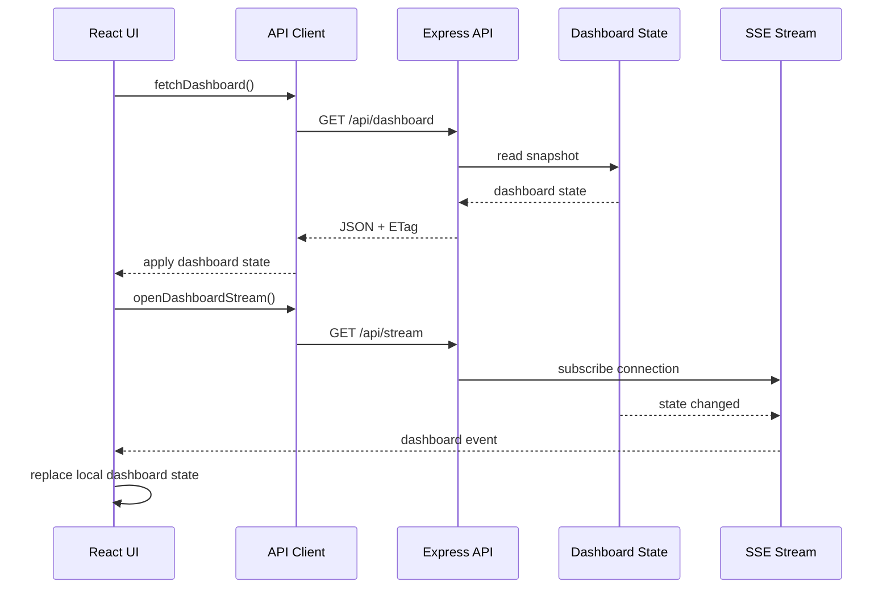
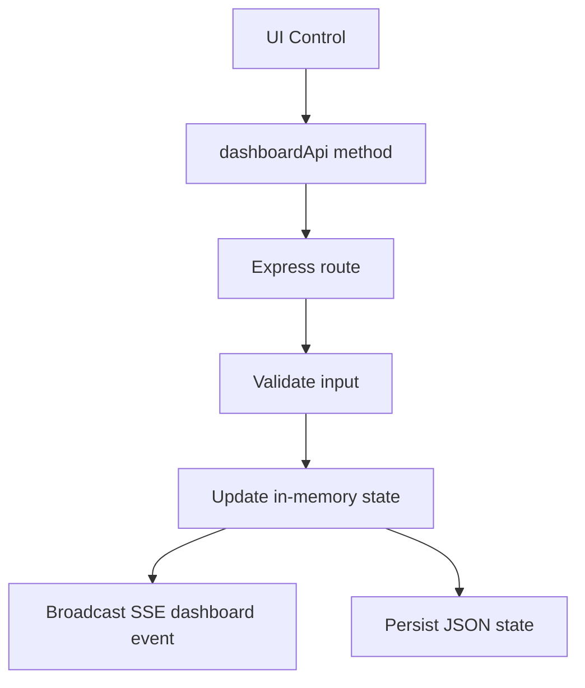
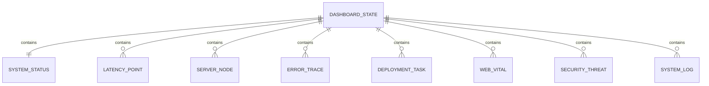
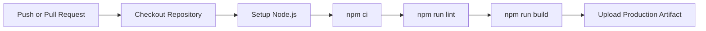

# DevDash Architecture

This document explains how DevDash is structured, how data moves through the app, and how the CI/CD pipeline should work when the project is published to GitHub.

## System Overview

DevDash is a same-origin full-stack application. The browser loads a React dashboard from the Node server, then communicates with the Express API for snapshots, mutations, and live updates.



## Runtime Data Flow

The frontend starts with a full dashboard snapshot and then receives incremental live dashboard updates over server-sent events.



## Action Flow

Every user action goes through the same pattern:

1. User selects an explicit control.
2. UI calls a typed API client function.
3. Express validates the request.
4. State is mutated in memory.
5. A new state version is broadcast over SSE.
6. State is persisted to disk after a short debounce.



## Backend Modules

| Area | Responsibility |
| --- | --- |
| `server/index.ts` | Express app, API routes, Vite middleware in development, static asset serving in production. |
| `server/state.ts` | Dashboard state, mutations, validation, SSE subscribers, ETags, persistence, telemetry simulation. |
| `src/types.ts` | Shared TypeScript contracts used by frontend and backend. |
| `src/apiClient.ts` | Typed browser-side API wrapper for dashboard actions. |
| `src/components/*` | Focused UI panels for overview, services, vitals, incidents, deployments, security, logs, and commands. |

## State Shape



## CI/CD Pipeline

The repository includes a GitHub Actions workflow for continuous integration. It installs dependencies, type-checks the app, builds the frontend, and bundles the production server.



## Deployment Model

DevDash can be deployed anywhere that can run a Node server:

- Render
- Railway
- Fly.io
- DigitalOcean App Platform
- VPS with Node and a process manager
- Docker-based hosting after a Dockerfile is added

The production command is:

```bash
npm run build
npm run start
```

The server must serve both:

- `/api/*` routes from Express
- built static UI assets from `dist/`

## Reliability Notes

- Reads are fast because the dashboard snapshot is kept in memory.
- Dashboard JSON is cached until state changes.
- ETags prevent unnecessary full payload responses.
- SSE avoids frontend polling.
- Runtime state is persisted to JSON, but this is not a replacement for a production database.

## Security Notes

The current project is a local/demo dashboard. Before production use:

- Add authentication.
- Add role-based authorization for node, deployment, incident, and command actions.
- Add audit logs for every mutation.
- Add rate limiting.
- Add schema validation for all API request bodies.
- Replace simulated commands with safe, reviewed operations.

